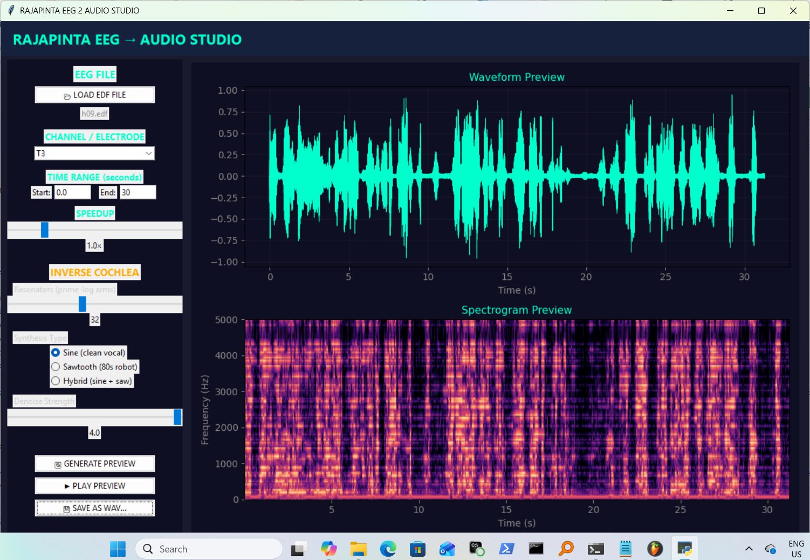

# RAJAPINTA EEG 2 AUDIO STUDIO

Video: https://youtu.be/a-RwPRtmTYQ

**A scientific instrument for exploring continuous brain dynamics as discrete, speech-like acoustic events.**

---

## Overview

`eeg2audio_studio.py` is an interactive GUI application that converts raw EEG recordings into audio using a **prime-logarithmic resonator bank** (the "Inverse Cochlea"). 

It allows researchers and explorers to:
- Load any EDF file
- Select specific channels and time windows
- Interactively adjust synthesis parameters
- Visually preview the resulting waveform and spectrogram in real time
- Export clean, denoised audio

The core hypothesis is that **speech-like temporal envelopes** emerge naturally when brain signals are processed through a geometrically structured resonance network based on prime-number logarithms.

---

## Scientific Motivation

Human speech and cognition are characterized by **rhythmic temporal envelopes** — syllable pacing in the theta band (~4–8 Hz) and phonemic detail in gamma (~30–80 Hz). Standard spectral analysis (FFT) often treats EEG as "noise," but this system instead treats it as a **driven, weakly coupled oscillator field**.

The key insight is that by using a **non-repeating, incommensurable frequency lattice** (prime logarithms), the system can:
- Detect phase-coherence events between the EEG voltage and the resonator bank
- Produce discrete "spikes" or energy bursts when constructive interference occurs
- Generate audio whose **amplitude envelope** closely follows the brain's own rhythmic structure

This is a toy model for **continuous-to-discrete transduction** — how a continuous dynamical system can selectively emit discrete events at structurally salient moments (a phenomenon also seen in extreme event precursors, spiking neural networks, and certain interpretations of quantum measurement).

---

## How It Works

### 1. Prime-Log Anti-Cochlea (Core Engine)

- Generates 8–64 resonators whose natural frequencies are derived from the logarithms of prime numbers (a Connes-inspired "spectral triple" geometry).
- Maps these frequencies to both brain-relevant (0.5–45 Hz) and audio-relevant (80–5000 Hz) ranges.
- For each EEG sample, every resonator accumulates **phase coherence** with the incoming voltage via a leaky integrator.
- When coherence exceeds a threshold, the corresponding audio-frequency oscillator is excited.

### 2. Synthesis Types

| Mode     | Description                              | Character                  |
|----------|------------------------------------------|----------------------------|
| **Sine**     | Pure sinusoidal carriers                 | Clean, vocal, formant-like |
| **Sawtooth** | Harmonic-rich (classic 80s robot)        | Buzzer, aggressive         |
| **Hybrid**   | 70% sine + 30% sawtooth                  | Balanced, speech-like      |

### 3. Automatic Spectral Denoising

After synthesis, the system automatically:
- Identifies low-energy ("quiet") frames in the spectrogram — the brain's natural pauses
- Builds a noise profile from these regions
- Performs **spectral subtraction** with over-subtraction and flooring

This removes residual "bell leakage" while preserving the rhythmic envelope structure — exactly analogous to manual noise sampling in audio editors, but fully automatic.

---

## GUI Features

- **EDF Loader** with automatic channel detection
- **Interactive Time Selection** (start / end in seconds)
- **Speed Control** (0.25× – 4× real-time)
- **Real-time Preview**:
  - Waveform view
  - Full spectrogram (0–5000 Hz)
- **Live Parameter Adjustment**:
  - Number of prime-log resonators (8–64)
  - Synthesis type (Sine / Sawtooth / Hybrid)
  - Denoise strength (0.0 – 4.0)
- **Instant Playback** of preview
- **Export** to 16 kHz mono WAV

---

## Scientific Context & Related Concepts

- **Noncommutative Geometry** (Alain Connes): The prime-log lattice functions as a discrete "spectrum" on which brain states evolve.
- **Noise-Vocoded Speech** (Shannon et al., 1995): Demonstrated that temporal envelopes alone carry most of the information needed for intelligibility. This system generates such envelopes directly from neural data.
- **Event Generation in Nonlinear Fields**: The coherence-thresholding mechanism is a classical analogue of how continuous systems can produce discrete "measurements" or spikes at extremal states.
- **Neuromorphic & Speech BCI**: The architecture is directly relevant to brain-computer interfaces that aim to reconstruct speech from imagined or attempted speech signals (e.g., NeuroTalk, recent sEEG envelope reconstruction studies).
- **Takens Embedding & Attractor Geometry**: The output envelopes can be viewed as projections of a high-dimensional neural manifold sampled at resonance points.

---

## Current Status & Next Steps

The studio currently produces **high-quality speech-like envelopes** with clear syllabic rhythm and prosodic contour. The next major development is the integration of a **built-in multi-band vocoder** stage, allowing the envelopes to directly modulate a clean carrier (noise or harmonic) inside the same interface — moving from "brain rhythm" to "brain speech."

---

## Requirements

- Python 3.9+
- `mne`, `numpy`, `scipy`, `soundfile`, `matplotlib`, `tkinter` (standard library)

---

## Citation / Philosophy

> "We are not sonifying EEG.  
> We are asking whether a geometrically structured resonance field can make the brain's internal rhythms audible — and whether those rhythms already contain the temporal skeleton of speech."

This project sits at the intersection of:
- Dynamical systems & event generation
- Noncommutative geometry
- Speech neuroscience
- Brain-computer interfaces

---

**Author**: Rajapinta research collective  
**Version**: 2026-05 (GUI v1.0 + Prime-Log Anti-Cochlea + Spectral Denoising)

---
